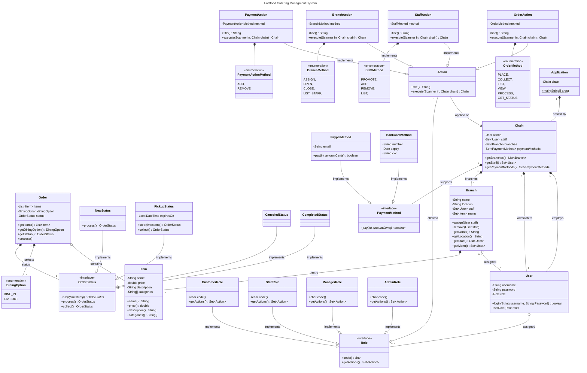

# SC2002 Assignment Class Diagram

## Design Considerations

### Order Status: State Pattern

### Payment Method:  Strategy Pattern

### Action: Command Pattern

### Persistence: Java Serialisation
