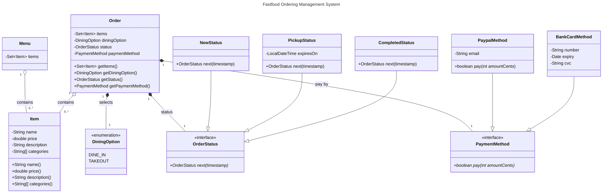

# Class Diagram 

```mermaid
---
title: Fastfood Ordering Management System
---
classDiagram
    class Item {
        -String name
        -double price
        -String description
        -String[] categories
        
        +String name()
        +double price()
        +String description()
        +String[] categories()
    }

    class Menu {
        -Set~Item~ items
    }
    Menu "1" o-- "0..*" Item: contains

    class Order {
        -Set~Item~ items
        -DiningOption diningOption
        -OrderStatus status
        -PaymentMethod paymentMethod
    
        +Set~Item~ getItems()
        +DiningOption getDiningOption()
        +OrderStatus getStatus()
        +PaymentMethod getPaymentMethod()
    }
    Order "1" o-- "0..*" Item: contains
    Order "1" *-- "1" DiningOption: selects
    Order "1" *-- "1" OrderStatus: status
    Order "1" *-- "1" PaymentMethod: pay by
    
    class DiningOption {
        <<enumeration>>
        DINE_IN
        TAKEOUT
    }

    class OrderStatus {
        <<interface>>
        +OrderStatus next(timestamp)*
    }

    class NewStatus {
        +OrderStatus next(timestamp)
    }
    NewStatus --|> OrderStatus
    
    class PickupStatus {
        -LocalDateTime expiresOn
        +OrderStatus next(timestamp)
    }
    PickupStatus --|> OrderStatus
    
    
    class CompletedStatus {
        +OrderStatus next(timestamp)
    }
    CompletedStatus --|> OrderStatus

    class PaymentMethod {
        <<interface>>
        +boolean pay(int amountCents)*
    }

    class PaypalMethod {
        -String email
        +boolean pay(int amountCents)
    }
    PaypalMethod --|> PaymentMethod

    class BankCardMethod {
        -String number
        -Date expiry
        -String cvc
    }
    BankCardMethod --|> PaymentMethod

```
