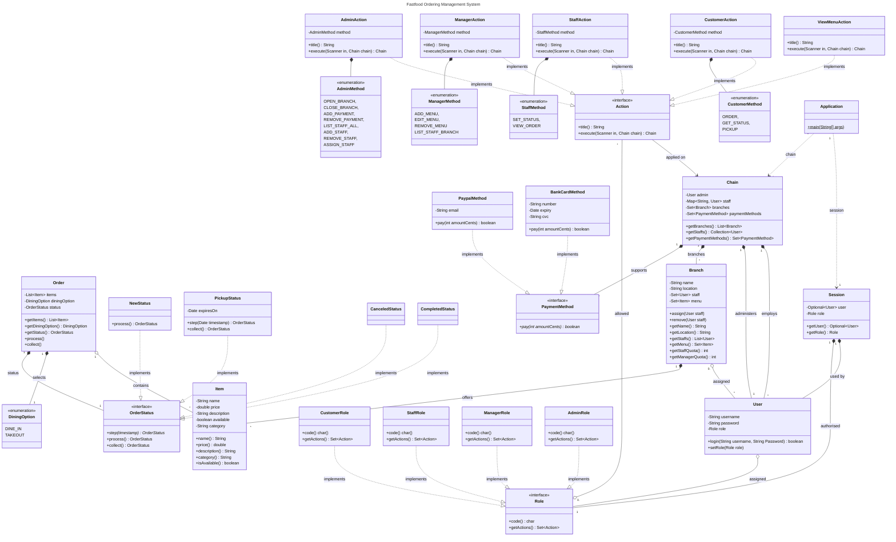

# SC2002 Assignment Class Diagram

```mermaid
---
title: Fastfood Ordering Management System
---
classDiagram
    class Item {
        -String name
        -double price
        -String description
        -boolean available
        -String category

        +name() String
        +price() double 
        +description() String 
        +category() String
        +isAvailable() boolean
    }

    class Order {
        -List~Item~ items
        -DiningOption diningOption
        -OrderStatus status
    
        +getItems() List~Item~
        +getDiningOption() DiningOption 
        +getStatus() OrderStatus 
        +process()
        +collect()
    }
    Order "1" o-- "*" Item: contains
    Order "1" *-- "1" DiningOption: selects
    Order "1" *-- "1" OrderStatus: status
    
    class DiningOption {
        <<enumeration>>
        DINE_IN
        TAKEOUT
    }

    %% Order Statuses
    class OrderStatus {
        <<interface>>
        +step(timestamp) OrderStatus* 
        +process() OrderStatus 
        +collect() OrderStatus 
    }

    class NewStatus {
        +process() OrderStatus 
    }
    NewStatus ..|> OrderStatus: implements
    
    class PickupStatus {
        -Date expiresOn
        +step(Date timestamp) OrderStatus 
        +collect() OrderStatus 
    }
    PickupStatus ..|> OrderStatus: implements
    
    class CanceledStatus {
    }
    CanceledStatus ..|> OrderStatus: implements
    
    class CompletedStatus {
    }
    CompletedStatus ..|> OrderStatus: implements

    %% Payment methods
    class PaymentMethod {
        <<interface>>
        +pay(int amountCents) boolean*
    }

    class PaypalMethod {
        -String email
        +pay(int amountCents) boolean 
    }
    PaypalMethod ..|> PaymentMethod: implements

    class BankCardMethod {
        -String number
        -Date expiry
        -String cvc
        +pay(int amountCents) boolean 
    }
    BankCardMethod ..|> PaymentMethod: implements

    %% Actions
    class Action {
        <<interface>>
        +title() String 
        +execute(Scanner in, Chain chain) Chain 
    }
    Action --> Chain: applied on

    class ViewMenuAction {
        +title() String 
        +execute(Scanner in, Chain chain) Chain 
    }
    ViewMenuAction ..|> Action: implements
    
    class CustomerMethod {
        <<enumeration>>
        ORDER,
        GET_STATUS,
        PICKUP
    }
    
    class CustomerAction {
        -CustomerMethod method
        +title() String 
        +execute(Scanner in, Chain chain) Chain 
    }
    CustomerAction ..|> Action: implements
    CustomerAction *-- CustomerMethod

    class StaffMethod {
        <<enumeration>>
        SET_STATUS,
        VIEW_ORDER
    }

    class StaffAction {
        -StaffMethod method
        +title() String 
        +execute(Scanner in, Chain chain) Chain 
    }
    StaffAction ..|> Action: implements
    StaffAction *-- StaffMethod
    
    class ManagerMethod {
        <<enumeration>>
        ADD_MENU,
        EDIT_MENU,
        REMOVE_MENU
        LIST_STAFF_BRANCH
    }

    class ManagerAction {
        -ManagerMethod method
        +title() String 
        +execute(Scanner in, Chain chain) Chain 
    }
    ManagerAction ..|> Action: implements
    ManagerAction *-- ManagerMethod
    
    class AdminMethod {
        <<enumeration>>
        OPEN_BRANCH,
        CLOSE_BRANCH,
        ADD_PAYMENT,
        REMOVE_PAYMENT,
        LIST_STAFF_ALL,
        ADD_STAFF,
        REMOVE_STAFF,
        ASSIGN_STAFF
    }
    
    class AdminAction {
        -AdminMethod method
        +title() String 
        +execute(Scanner in, Chain chain) Chain 
    }
    AdminAction ..|> Action: implements
    AdminAction *-- AdminMethod

    %% Identity & Access
    class Role {
        <<interface>>
        +code() char 
        +getActions() Set~Action~
    }
    Role "0." o-- "*" Action: allowed

    class CustomerRole {
        +code() char()
        +getActions() Set~Action~
    }
    CustomerRole ..|> Role: implements

    class StaffRole {
        +code() char()
        +getActions() Set~Action~
    }
    StaffRole ..|> Role: implements
    
    class ManagerRole {
        +code() char()
        +getActions() Set~Action~
    }
    ManagerRole ..|> Role: implements

    class AdminRole {
        +code() char()
        +getActions() Set~Action~
    }
    AdminRole ..|> Role: implements

    class User {
        -String username
        -String password
        -Role role
        +login(String username, String Password) boolean 
        +setRole(Role role)
    }
    User o-- Role: assigned

    %% Fast Food Chain & Branch
    class Branch {
        -String name
        -String location
        -Set~User~ staff
        -Set~Item~ menu

        +assign(User staff)
        +remove(User staff)
        +getName() String 
        +getLocation() String 
        +getStaffs() List~User~
        +getMenu() Set~Item~
        +getStaffQuota() int
        +getManagerQuota() int
    }
    Branch "0." o-- "*" User: assigned
    Branch "1" *-- "*" Item: offers

    class Chain {
        -User admin
        -Map~String, User~ staff
        -Set~Branch~ branches
        -Set~PaymentMethod~ paymentMethods
        
        +getBranches() List~Branch~
        +getStaffs() Collection~User~
        +getPaymentMethods() Set~PaymentMethod~
    }
    Chain "1" *-- "*" User: employs
    Chain "1" *-- "1" User: administers
    Chain "1" *-- "*" Branch: branches
    Chain "1" *-- "*" PaymentMethod: supports

    %% Session
    class Session {
        -Optional~User~ user
        -Role role
        
        +getUser() Optional~User~
        +getRole() Role
    }
    Session "1" *-- "*" User: used by
    Session "1" *-- "1" Role: authorised

    %% Application
    class Application {
        +main(String[] args)$
    }
    Application "1" ..> "1" Session: session
    Application "1" ..> "1" Chain: chain
```

## Design Considerations
### Order Status: State Pattern

### Payment Method & Action: Strategy Pattern

### Persistence: Java Serialisation
