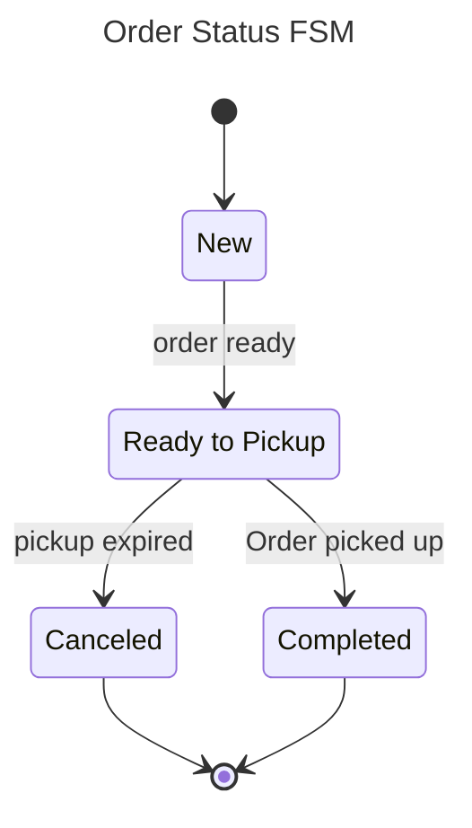
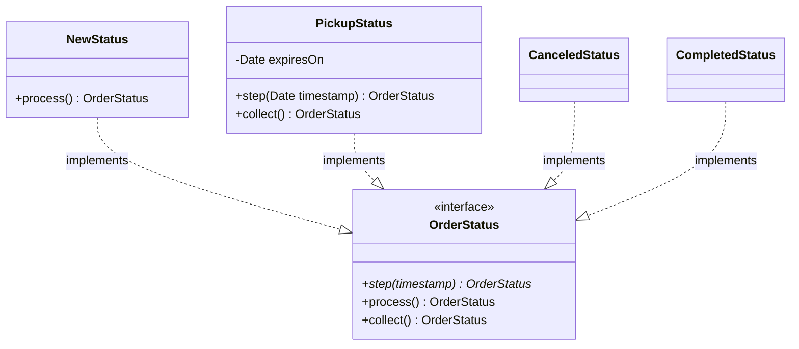
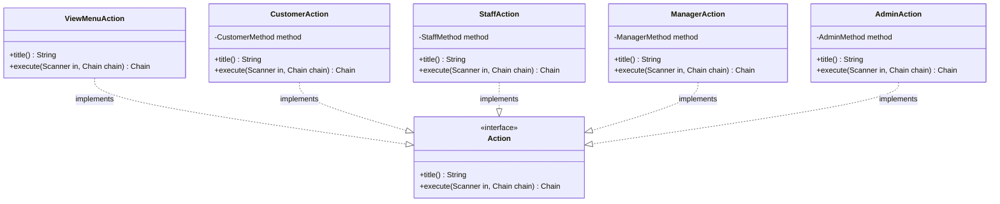

# Design Considerations

### Order Status: State Pattern
Throughout the lifecycle of the Fast Food Order, the Order transitions between several statuses: "New", "Ready to Pickup", "Canceled" modelled in below Finite State Machine (FSM):

Although these state transitions in the above could have been implemented in chain of conditional if/else statements, this implementation is undesirable as it can lead to complex mess implementing state transitions between all states. This violates the the Single-Responsibility principle as we are handling state transitions for all states.

Instead, these state transitions naturally lend itself to be modelled by the State design pattern.  Each state is represented by its own class and is responsible for its own transitions to other state objects. An interface provides a consistent way to interact with all state objects, implementing Dependency Inversion design principle by having Order depend on an Order Status interface instead of specific Order Status classes. By encapsulating state transition logic into individual state classes, we reduce isolate its complexity into manageable chunks, implementing the Single-Responsibility design principle.

### Payment Method: Strategy Pattern
The assignment outlines the extensibility of supported payment methods as one of its requirements, imploring us to design the code in way that facilitates the ease of adding new payment methods. 

Regardless of implementation, all payment methods should function the same way: process a deduction of the fast food order's cost. The specific steps of algorithm performing the deduction is irrelevant to the rest of the application. 

The Strategy design pattern implements this by encapsulating the specifics of each payment method in its own class, enforcing the Single-Responsibility design principle. Again an interface provides a consistent means of placing a deduction for the order for consumers, implementing the Dependency Inversion principle by having consumers depend on an abstract interface instead of a concrete class implementation.

Assuming all payment methods behave the same, they can be transparent swapped for each other by the Liskov Substitution design principle. New payment methods can be added without modifying the code for existing methods by extending the payment method interface, aligning with Open-Closed design principle.

### Action: Command Pattern
On a fundamental level, the FOMS application dispatches specific actions based on user command line input selections: placing orders, assigning staff, changing the menu etc. To the application, the specific details of how an action is performed, which inputs it requires is irrelevant.

We hide implementation details of each action using the Command design pattern. Each action is a parameterised instance internally handles all the intricacies of performing that action, fulfilling the Single-Responsibility principle. Instead of creating a class for each possible action, we grouped actions by user role to avoid class explosion created by create a class for each action.

Externally an Action interface enforces a consistent outward facing interface for executing any action. This interface is relied upon by the application instance invoking the action's execution, conforming to the dependency-inversion principle. The design also lends itself favourable to future extensibility: new actions can be easily added by implementing the actions interface.

### Persistence: Java Serialisation
Another requirement of FOMS is ability to save and restore application state. The user should be able to quit the application and resume exactly where they left off, the application functionally identical to as if the closure of application never happened. 

From the onset, we have architected FOMS's class structure to facilitate easy serialisation. The entire application state: the fast food chain with its all its branches, menus, staff, managers & admin is composed within a single Chain object. As a result, implementing serialisation of the application state is as simple encoding of one object.

Java serialisation was selected it is ready available. Being built in into the Java JDK, no external dependencies have to bundled with the application to implement serialisation. Since the writer and reader of the application state is FOMS application itself, there is no need for the state to parsable by external applications. Since there would only be one version of FOMS for implemented for the assignment, there is also no requirement the encoded state to be forward or backwards compatible. Thus, Java serialisation was selected as our encoding method.
## Challenges

### Grouping Actions
We found deciding on the cardinality of grouping Actions into classes particularly challenging. On one hand we did not want to violate the Responsibility principle by grouping all action logic into one application class. On the other hand  we wanted to avoid an over proliferation classes inherent in creating one class for each possible action. The solution the cardinality problem lies between these two extremes.

Our initial approach was to group Actions into classes based on the specific data entity it is performed on: Order Actions, Branch Actions, Payment Method Actions etc. This approach was inspired by the resource oriented design of REST API, with methods performed on resources. However, this architecture became infeasible when considering the List Staff operation. 

For the users holding the Manager role, List Staff should be only scoped to the specific branch they are managing while for users holding the Admin role, listing should list all staff in the Fast Food Chain. A quick patch that was considered was to pass the user's Role to all actions so that action logic can be altered based on role. This proposal was rejected as it violates the Interface Segregation design principle as not all actions requires the Role to be passed. Actions should perform the task, not decide on whether to do the task itself.

A key cornerstone of the FOMS its to only offer relevant actions to the user based on the user's role. Customers should able to place orders while staff are able to process them. Managers should not be able assign staff to other branches. This lends to a natural grouping of actions by Role: all actions implemented by a specific Role action class infer the same level of access granted by the Role. Separation of actions by Role allows us solve the List Staff problem by crafting different implementations for each Role. For actions that are shared by multiple roles: Viewing Menu, a distinct action class is created to ensure that its business logic is not repeated.
