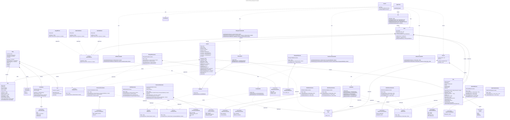

# Class Diagram

```mermaid
---
title: Fastfood Ordering Management System
---
classDiagram
    class Item {
        -String name
        -double price
        -String description
        -boolean available
        -String category

        +getName() String
        +getPrice() double
        +getDescription() String
        +getCategory() String
        +getAvailable() boolean
        +setPrice(double newPrice)
        +setDescription(String newDescription)
        +setAvailable(boolean newAvailable)
    }

    class Order {
        -List~Item~ items
        -DiningOption diningOption
        -OrderStatus orderStatus
        -int orderID

        +getItems() List~Item~
        +getDiningOption() DiningOption
        +getOrderStatus() orderStatus
        +getId() int
        +process()
        +collect()
        +cancel()
    }
    Order "1" o-- "*" Item: contains
    Order "1" *-- "1" DiningOption: selects
    Order "1" *-- "1" OrderStatus: contains
    Order "1" *-- "1" Cart: contains

    class DiningOption {
        <<enumeration>>
        DINE_IN
        TAKEOUT
    }

    class Cart {
        -List~Item~ cartItems
        +addCart(Item item)
        +removeCart(int itemIndex)
        +viewCart()
    }

    %% Order Statuses
    class OrderStatus {
        -OrderStatusType status
        -Date timestamp
        +getStatus() OrderStatusType
        +getTimestamp() Date
        +setStatus(OrderStatusType newStatus)
        +setTimestamp(Date newTimestamp)
    }
    OrderStatus "1" *-- "1" OrderStatusType: selects

    class OrderStatusType {
        <<enumeration>>
        NEW
        READY_TO_PICKUP
        COMPLETED
        CANCELLED
    }

    class Expired {
        +getTime()
        +cancelChecker(Branch branch)
        +checkExpired(Branch branch)
    }

    %% Payment methods
    class PaymentMethod {
        <<interface>>
        +getName() String
        +pay(int amountCents, Scanner in) boolean*
    }

    class PaypalMethod {
        -String name
        +getName() String
        +pay(int amountCents, Scanner in) boolean
    }
    PaypalMethod ..|> PaymentMethod: implements

    class BankCardMethod {
        -String name
        +getName() String
        +pay(int amountCents, Scanner in) boolean
    }
    BankCardMethod ..|> PaymentMethod: implements

    class PayNowMethod {
        -String name
        +getName() String
        +pay(int amountCents, Scanner in) boolean
    }
    PayNowMethod ..|> PaymentMethod: implements

    %% Role-based Actions
    class AdminAction {
        <<interface>>
        +title() String
        +execute(Scanner in, Chain chain) Chain
    }

    class CustomerAction {
        <<interface>>
        +title() String
        +execute(Scanner in, Branch branch, Set<PaymentMethod> paymentMethods) Branch
    }

    class ManagerAction {
        <<interface>>
        +title() String
        +execute(Scanner in, Branch branch) Branch
    }

    class StaffAction {
        <<interface>>
        +title() String
        +execute(Scanner in, Branch branch) branch
    }

    %% Customer tasks
    class CustomerActionHandler {
        +actionDispatcher(Scanner in, Branch branch, Set<PaymentMethod> paymentMethods) Branch $
        +handleAction(List~CustomerAction~ customerActions, Scanner in, Branch branch, Set<PaymentMethod> paymentMethods) Branch $
    }
    CustomerActionHandler "1" ..> "1" CustomerRole: uses

    class CustomerRole {
        +code() char()
        +getOrderActions() List~CustomerAction~ $
        +getCollectActions() List~CustomerAction~ $
    }
    CustomerRole ..|> Role: implements
    CustomerRole ..> CustomerAction: creates

    class CustomerCollectAction {
        -CustomerCollectMethod method
        +title() String
        +execute(Scanner in, Branch branch, Set<PaymentMethod> paymentMethods) Branch
        -viewOrderStatus(Scanner in, Branch branch)
        -collect(Scanner in, Branch branch)
    }
    CustomerCollectAction ..|> CustomerAction: implements
    CustomerCollectAction "1" *-- "1" CustomerCollectMethod

    class CustomerCollectMethod {
        <<enumeration>>
        VIEW_ORDER_STATUS
        COLLECT
    }

    class CustomerOrderAction {
        -CustomerOrderMethod method
        -Cart myCart
        -double totalPrice
        +title() String
        +execute(Scanner in, Branch branch, Set<PaymentMethod> paymentMethods) Branch
        -viewCart()
        -addToCart(Scanner in, Set<Item> menu) boolean
        -removeFromCart(Scanner in) boolean
        -pay(Scanner in, Branch branch, Set<PaymentMethod> paymentMethods) boolean
        -createOrder(Scanner in, Branch branch) Order
    }
    CustomerOrderAction ..|> CustomerAction: implements
    CustomerOrderAction "1" *-- "1" CustomerOrderMethod

    class CustomerOrderMethod {
        <<enumeration>>
        ADD_TO_CART
        REMOVE_FROM_CART
        VIEW_CART
        PAY
    }

    %% staff tasks
    class StaffActionHandler {
        +actionDispatcher(Scanner in, Branch branch) Branch $
        +handleAction(List~StaffAction~ staffActions, Scanner in, Branch branch) Branch $
    }
    StaffActionHandler "1" ..> "1" StaffRole: uses

    class StaffRole {
        +code() char()
        +getOrderActions() List~StaffAction~ $
    }
    StaffRole ..|> Role: implements
    StaffRole ..> StaffAction: creates

    class StaffOrderAction {
        -StaffOrderMethod method
        +title() String
        +execute(Scanner in, Branch branch) Branch
        -viewOrders(Scanner in, Branch branch)
        -viewOrderDetails(Scanner in, Branch branch)
        -processOrder(Scanner in, Branch branch) Branch
    }
    StaffOrderAction ..|> StaffAction: implements
    StaffOrderAction "1" *-- "1" StaffOrderMethod

    class StaffOrderMethod {
        <<enumeration>>
        VIEW_ORDERS
        VIEW_ORDER_DETAILS
        PROCESS_ORDER
    }

   %% manager tasks
    class ManagerActionHandler {
        +actionDispatcher(Scanner in, Branch branch) Branch $
        +handleAction(List~ManagerAction~ managerActions, Scanner in, Branch branch) Branch $
        +handleAction(List~StaffAction~ staffActions, Scanner in, Branch branch) Branch $
    }
    ManagerActionHandler "1" ..> "1" ManagerRole: uses

    class ManagerRole {
        +code() char()
        +getMenuActions() List~ManagerAction~ $
        +getStaffActions() List~ManagerAction~ $
    }
    ManagerRole ..|> Role: implements
    ManagerRole --|> StaffRole: extends
    ManagerRole ..> ManagerAction: creates

    class ManagerMenuAction {
        -ManagerMenuMethod method
        +title() String
        +execute(Scanner in, Branch branch) Branch
        -addItem(Scanner in, Branch branch)
        -removeItem(Scanner in, Branch branch)
        -updateItem(Scanner in, Branch branch)
    }
    ManagerMenuAction ..|> ManagerAction: implements
    ManagerMenuAction "1" *-- "1" ManagerMenuMethod

    class ManagerMenuMethod {
        <<enumeration>>
        ADD_ITEM
        REMOVE_ITEM
        UPDATE_ITEM
    }

    class ManagerStaffAction {
        -ManagerStaffMethod method
        +title() String
        +execute(Scanner in, Branch branch) Branch
        -listStaffAll(Scanner in, Branch branch)
    }
    ManagerStaffAction ..|> ManagerAction: implements
    ManagerStaffAction "1" *-- "1" ManagerStaffMethod

    class ManagerStaffMethod {
        <<enumeration>>
        LIST_STAFF_ALL
    }

    
    %% admin tasks
    class AdminActionHandler {
        +actionDispatcher(Scanner in, Chain chain) Chain $
        +handleAction(List~AdminAction~ adminActions, Scanner in, Chain chain) Chain $
    }
    AdminActionHandler "1" ..> "1" AdminRole: uses

    class AdminRole {
        +code() char()
        +getTransferAction() List~AdminAction~ $
        +getPromotionAction() List~AdminAction~ $
        +getStaffAction() List~AdminAction~ $
        +getPaymentAction() List~AdminAction~ $
        +getBranchAction() List~AdminAction~ $
    }
    AdminRole ..|> Role: implements
    AdminRole ..> AdminAction: creates


    class AdminBranchAction {
        -AdminBranchMethod method
        +title() String
        +execute(Scanner in, Chain chain) Chain
        -openBranch(Scanner in, Chain chain)
        -closeBranch(Scanner in, Chain chain)
    }
    AdminBranchAction ..|> AdminAction: implements
    AdminBranchAction "1" *-- "1" AdminBranchMethod

    class AdminBranchMethod {
        <<enumeration>>
        OPEN_BRANCH
        CLOSE_BRANCH
    }

    class AdminPaymentAction {
        -AdminPaymentMethod method
        +title() String
        +execute(Scanner in, Chain chain) Chain
        -addPayment(Scanner in, Chain chain)
        -removePayment(Scanner in, Chain chain)
    }
    AdminPaymentAction ..|> AdminAction: implements
    AdminPaymentAction "1" *-- "1" AdminPaymentMethod

    class AdminPaymentMethod {
        <<enumeration>>
        ADD_PAYMENT
        REMOVE_PAYMENT
    }

    class AdminPromotionAction {
        -AdminPromotionMethod method
        +title() String
        +execute(Scanner in, Chain chain) Chain
        -assignManager(Scanner in, Chain chain)
        -promoteStaff(Scanner in, Chain chain)
    }
    AdminPromotionAction ..|> AdminAction: implements
    AdminPromotionAction "1" *-- "1" AdminPromotionMethod

    class AdminPromotionMethod {
        <<enumeration>>
        ASSIGN_MANAGER
        PROMOTE_STAFF
    }

    class AdminStaffAction {
        -AdminStaffMethod method
        +title() String
        +execute(Scanner in, Chain chain) Chain
        -addStaff(Scanner in, Chain chain)
        -editStaff(Scanner in, Chain chain)
        -removeStaff(Scanner in, Chain chain) 
        -listStaffAll(Scanner in, Chain chain)
    }
    AdminStaffAction ..|> AdminAction: implements
    AdminStaffAction "1" *-- "1" AdminStaffMethod

    class AdminStaffMethod {
        <<enumeration>>
        ADD_STAFF
        EDIT_STAFF
        REMOVE_STAFF
        LIST_STAFF_ALL
    }


    class AdminTransferAction {
        -AdminTransferMethod method
        +title() String
        +execute(Scanner in, Chain chain) Chain
        -transferStaff(Scanner in, Chain chain)
    }
    AdminTransferAction ..|> AdminAction: implements
    AdminTransferAction "1" *-- "1" AdminTransferMethod

    class AdminTransferMethod {
        <<enumeration>>
        TRANSFER_STAFF
    }

    %% Identity & Access
    class Role {
        <<interface>>
        +code() char
    }

    class Gender {
        <<enumeration>>
        MALE,
        FEMALE,
        UNKNOWN
    }

    class User {
        -String username
        -String name
        -String branchBelongTo;
        -int age
        -String password
        -Gender gender
        -Role role
        +login(String username, String Password) boolean
        +getUsername() String
        +getName() String
        +getBranchBelongTo(): String
        +getAge() int
        +getPassword() String
        +getGender() String
        +setPassword(String password)
        +setRole(Role role)
        +setName(String name)
        +setAge(int age)
        +setGender(Gender gender)
        +setBranchBelongTo(String branchBelongTo)
    }
    User o-- Role: assigned
    User *-- Gender: gender

    %% Fast Food Chain & Branch
    class Branch {
        -String name
        -String location
        -Set~User~ staffs
        -Set~User~ managers
        -Set~Item~ menu
        -List~Order~ newOrderList;
        -List~Order~ readyToPickupList;
        -List~Order~ completedOrderList;
        -List~Order~ cancelledOrderList;
        -int orderId

        +assign(User staff)
        +remove(User staff)
        +getName() String
        +getLocation() String
        +getStaffs() List~User~
        +getManagers() List~User~
        +getMenu() Set~Item~
        +getStaffQuota() int
        +getManagerQuota() int
        +getReadyToPickupList() List~Order~
        +getNewOrderList() List~Order~
        +getCompletedOrderList() List~Order~
        +getCancelledOrderList() List~Order~
        +getOrderId() int
        +setOrderId()
    }
    Branch "0." o-- "*" User: assigned
    Branch "1" *-- "*" Item: offers

    class Chain {
        -User admin
        -Map~String, User~ staff
        -Set~Branch~ branches
        -Set~PaymentMethod~ paymentMethods

        +getBranches() List~Branch~
        +getStaffs() Collection~User~
        +getPaymentMethods() Set~PaymentMethod~
    }
    Chain "1" *-- "*" User: employs
    Chain "1" *-- "1" User: administers
    Chain "1" *-- "*" Branch: branches
    Chain "1" *-- "*" PaymentMethod: supports

    %% Session
    class Session {
        -Optional~User~ user
        -Role role

        +getUser() Optional~User~
        +getRole() Role
    }
    Session "1" *-- "*" User: used by
    Session "1" *-- "1" Role: authorised

    %% Application Init
    class Init {
        +initChain() Chain$
        -parseMenus(List~Row~ rows) Map~String, Set~$
        -parseStaffs(List~Row~ rows) Map~String, Set~$
        -parseBranches(List~Row~ rows) Map~String, Branch~$
        -readInitWorkbook(String path) List~Row~$
    }
    Init "1" ..> "1" Chain: initialises

    %% Application
    class Application {
        +main(String[] args)$
    }
    Application "1" ..> "1" Session: session
    Application "1" ..> "1" Chain: chain
    Application "1" ..> "1" Init: initialise
    Application "1" ..> "1" AdminActionHandler: uses
    Application "1" ..> "1" CustomerActionHandler: uses
    Application "1" ..> "1" ManagerActionHandler: uses
    Application "1" ..> "1" StaffActionHandler: uses
    Application "1" ..> "1" checkExpired: uses

```
